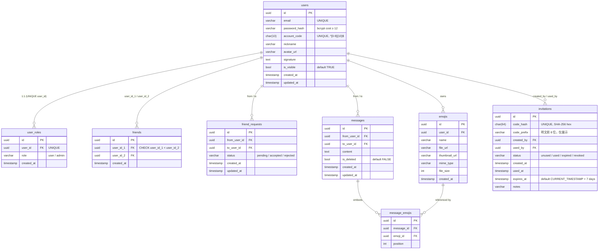

# ichatpp 数据库设计

> 基于 [`backend/migrations/`](../backend/migrations/) 当前迁移文件（截至 2026-05-07）。
> Postgres 14+。所有时间列均存 UTC（无时区列；应用层统一 UTC 写入）。

## ER 图



---

## 表清单

### `users` — 账号

| 列 | 类型 | 约束 | 说明 |
|---|---|---|---|
| `id` | UUID | PK, default `gen_random_uuid()` | 主键 |
| `email` | VARCHAR(255) | NOT NULL, UNIQUE | 登录凭证；写入前小写 + trim |
| `password_hash` | VARCHAR(255) | NOT NULL | bcrypt cost ≥ 12 |
| `account_code` | CHAR(10) | NOT NULL, UNIQUE, `CHECK (~ '^[0-9]{10}$')` | 公开账号码，注册时 OsRng 拒绝采样生成，碰撞重试 |
| `nickname` | VARCHAR(100) | — | 显示名 |
| `avatar_url` | VARCHAR(255) | — | MinIO/S3 URL |
| `signature` | TEXT | — | 个人签名 |
| `is_visible` | BOOLEAN | default TRUE | 对非好友是否可见（false 时按账号查找返回 404） |
| `created_at` / `updated_at` | TIMESTAMP | default `CURRENT_TIMESTAMP` | UTC |

### `user_roles` — 角色

1:1 与 users（`user_id` 上 UNIQUE，所以是 zero-or-one）。

| 列 | 类型 | 约束 |
|---|---|---|
| `id` | UUID | PK |
| `user_id` | UUID | NOT NULL, UNIQUE, FK→users(id) ON DELETE CASCADE |
| `role` | VARCHAR(50) | default `'user'`，应用层枚举 user/admin |
| `created_at` | TIMESTAMP | default `CURRENT_TIMESTAMP` |

### `friends` — 好友关系

每对好友只存一行，遵循 `user_id_1 < user_id_2`。

| 列 | 约束 |
|---|---|
| `user_id_1`, `user_id_2` | FK→users, UNIQUE 联合, **CHECK `user_id_1 < user_id_2`** |
| `created_at` | UTC |

### `friend_requests` — 好友请求

无表级 UNIQUE；改用部分唯一索引。详见 [部分唯一索引](#uq_friend_requests_pending-的设计意图)。

| 列 | 约束 |
|---|---|
| `from_user_id`, `to_user_id` | FK→users CASCADE |
| `status` | VARCHAR(20) default `'pending'` (pending / accepted / rejected) |

### `messages` — 消息

| 列 | 约束 |
|---|---|
| `from_user_id`, `to_user_id` | FK→users CASCADE |
| `content` | TEXT NOT NULL |
| `is_deleted` | BOOLEAN default FALSE |

软删除策略：`is_deleted=TRUE` 后，**content 列保留**（用于审计/恢复），读侧 `into_view` 渲染时替换为占位文案。

### `emojis` — 表情

| 列 | 约束 |
|---|---|
| `user_id` | FK→users CASCADE |
| `name`, `file_url` | NOT NULL |
| `thumbnail_url`, `mime_type`, `file_size` | nullable |

### `message_emojis` — 消息↔表情链接

| 列 | 约束 |
|---|---|
| `message_id`, `emoji_id` | FK CASCADE |
| `position` | INT NOT NULL（在消息内的顺序） |

> 注：emoji 删除是 CASCADE，会顺带删除链接行；消息本身**不**因表情删除而消失。

### `invitations` — 邀请码

**安全要点：DB 中只存 SHA-256 hash，明文仅在生成响应中返回一次。**

| 列 | 约束 |
|---|---|
| `code_hash` | CHAR(64) NOT NULL UNIQUE — `hex(sha256(plaintext))` |
| `code_prefix` | VARCHAR(8) — 明文前 8 字符，例：`INV-AbCd`，仅供 admin 列表展示，**不参与验证** |
| `created_by` | FK→users(id) CASCADE |
| `used_by` | FK→users(id) ON DELETE SET NULL |
| `status` | VARCHAR(20) default `'unused'` (unused / used / expired / revoked) |
| `expires_at` | TIMESTAMP default `CURRENT_TIMESTAMP + INTERVAL '7 days'` |

---

## 索引

### `users`

| 索引 | 用途 |
|---|---|
| `idx_users_account_code` | `GET /api/users/by-code/{code}` 查找 |

### `user_roles`

| 索引 | 用途 |
|---|---|
| `idx_users_role` | login / refresh 时 join 取 role |

### `messages`

| 索引 | 用途 |
|---|---|
| `idx_messages_conversation` (from, to, created_at DESC) | A→B 方向历史查询 |
| `idx_messages_conversation_reverse` (to, from, created_at DESC) | B→A 方向（双向匹配） |
| `idx_messages_created_at` | 全局按时间扫（导出、统计） |
| `idx_messages_content_fts` (GIN, `to_tsvector('simple', content)`) | 全文搜索 |

### `friends`

| 索引 | 用途 |
|---|---|
| `idx_friends_user1`, `idx_friends_user2` | `GET /api/friends` 任一方向都能命中 |

### `friend_requests`

| 索引 | 用途 |
|---|---|
| `uq_friend_requests_pending` (from, to) WHERE status='pending' | **部分唯一索引** — 见下文 |

### `invitations`

| 索引 | 用途 |
|---|---|
| `idx_invitations_code_hash` | 验证、注册时按 hash 查 |
| `idx_invitations_status` | admin 列表按状态过滤 |
| `idx_invitations_created_by` | admin 看自己批次 |
| `idx_invitations_expires_at` | 后台过期清理任务 |

---

## `uq_friend_requests_pending` 的设计意图

```sql
CREATE UNIQUE INDEX uq_friend_requests_pending
  ON friend_requests(from_user_id, to_user_id)
  WHERE status = 'pending';
```

**问题：** 一对用户之间可能有多条历史请求记录（先 reject → 后再发 → 再 accept），但**同时只能有一条 pending**，否则界面会出现重复通知 + 接受时的并发冲突。

**为什么不用全表 UNIQUE？**
- 全表 UNIQUE(from, to) 会禁止任何重复，连先前已 rejected 的也不能再发，破坏了"换人后再加"的合理流程
- 加 `status` 进 UNIQUE 不解决问题（'rejected' 也允许多个）

**为什么 partial 索引解决得很优雅？**
- WHERE 子句把约束作用域**限定到 `pending` 状态**
- INSERT 一条 pending 时，若已有同向 pending 行 → 23505 unique violation → 应用层返回 409
- 一旦 status 翻转为 accepted/rejected，行不再属于索引集合，下次发新请求不冲突
- B 树空间开销极小（只索引"活跃"行）

**应用层补充：** 该索引只覆盖**同方向**（A→B）。B→A 同时也有 pending 的情况（双向同时发起）由 [`pending_request_exists`](../backend/src/handlers/friends.rs) 在 INSERT 前手动检查，统一返回 409，使响应不依赖谁先到达。

---

## 约束清单（CHECK / FK / UNIQUE）

### CHECK
- `users.account_code ~ '^[0-9]{10}$'`
- `friends`：`user_id_1 < user_id_2`（保证一对只一行）

### UNIQUE
- `users.email`、`users.account_code`
- `user_roles.user_id`
- `friends(user_id_1, user_id_2)`
- `invitations.code_hash`
- `friend_requests(from_user_id, to_user_id) WHERE status='pending'` (partial)

### Foreign Keys（CASCADE 行为）

| 表 | FK | ON DELETE |
|---|---|---|
| `user_roles.user_id` | users(id) | CASCADE |
| `friends.user_id_1/2` | users(id) | CASCADE |
| `friend_requests.from/to_user_id` | users(id) | CASCADE |
| `messages.from/to_user_id` | users(id) | CASCADE |
| `emojis.user_id` | users(id) | CASCADE |
| `message_emojis.message_id` | messages(id) | CASCADE |
| `message_emojis.emoji_id` | emojis(id) | CASCADE |
| `invitations.created_by` | users(id) | CASCADE |
| `invitations.used_by` | users(id) | **SET NULL**（删除使用者保留邀请码记录） |

---

## 迁移管理

工具：sqlx-cli。文件位置：[`backend/migrations/`](../backend/migrations/)。

```bash
# 创建新迁移（生成 .up.sql / .down.sql 配对）
cd backend
sqlx migrate add -r <name>

# 应用
sqlx migrate run                          # 读 DATABASE_URL
sqlx migrate run --database-url postgresql://...

# 回滚最近一次
sqlx migrate revert
```

CI 执行约束：所有迁移必须在干净 Postgres 14 上跑通；不允许直接修改已发布的迁移文件，新变更走新迁移。

---

## 常见查询路径

### 历史消息分页（`GET /api/messages/{friend_id}`）
索引命中：`idx_messages_conversation` + `idx_messages_conversation_reverse`。游标基于 `(created_at DESC, id DESC)` 降序，下一页用元组比较。

### 全文搜索（`GET /api/messages/search`）
使用 `to_tsvector('simple', content) @@ plainto_tsquery('simple', $q)`。GIN 索引保证子查询不退化为 seq scan。同时再做 `(from_user_id = me OR to_user_id = me)` 过滤，确保只搜自己参与的对话。

### 邀请码验证（`POST /api/invitations/validate`）
计算 `hex(sha256(plain))` → 命中 `idx_invitations_code_hash` → 检查 `status='unused' AND expires_at > now()`。

### 好友列表（`GET /api/friends`）
`friends f JOIN users u ON u.id = CASE ... END`，按"最近消息时间"排序（子查询 `MAX(messages.created_at)`）。在小到中等好友量下足够；如果未来成为热点，可把 `last_message_at` 物化到 friends 表上。

---

*基于 ARCHITECTURE.md §5 与实际迁移文件生成；如有变更以迁移为准。*
